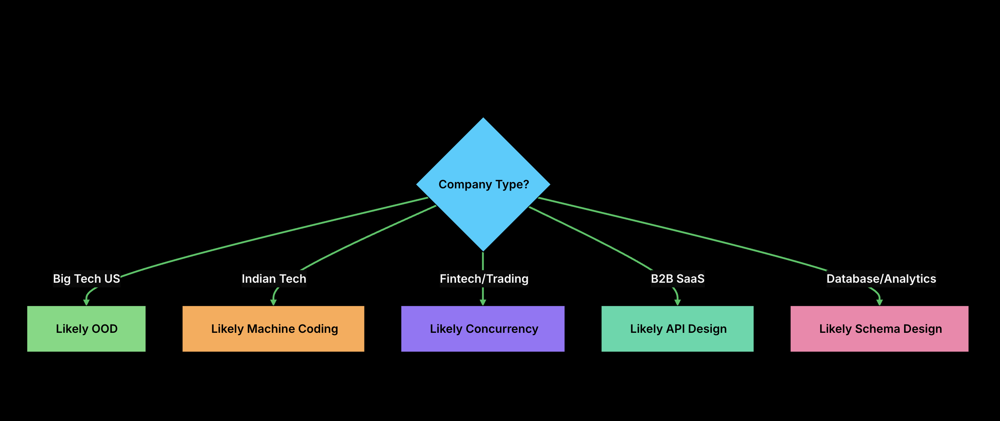

Companies do not evaluate LLD the same way , there are mainly 4 types of way an LLD interview can go-

# 1. OOD (Object Oriented Design) Round
- Most common for the product based companies
- In an OOD interview, you design a system by identifying classes, their attributes, methods, and relationships. The focus is on your design thinking rather than working code.
- Usually pseudocode (not runnable)
- Deliverable: Class diagrams, interface definitions, key method signatures
- What interviewers evaluate - proper use of OOPS concepts (abstraction , encapsulation , polymorphism), design patterns , SOLID principles, and the decision making , justification and tradeoff discussion

# 2. Machine Coding Round
- Use case will be given to us and we are expected to write the a working code in front of the interviewer
- What interviewers evaluate - are we able to write the correct code , how clean is the code , how accurate is the thinking , problem understanding and solving , edge case consideration, the project structure

# 3. Concurrency Design
Designing systems where concurrency matters and make thread safe systems . Thread safe systems mean that multiple threads (A thread is an independent path of execution inside a process) can access and modify shared data concurrently without causing incorrect or inconsistent results.

For eg. If we have 1000 in a bank account , a 2 threads have to run on it , both doing 800 deductions .
Thread A → withdraw(800)
Thread B → withdraw(800)

Initial balance = ₹1000
A: check balance >= 800 → YES
B: check balance >= 800 → YES

A: balance = 200
B: balance = -600
THIS BREAKS THE BUSINESS RULE!

A thread safe implementation for the rule will be - check balance -> deduct amount

- What interviewers evaluate - Can we identify which states are shared between threads, race conditions, threads which should work as one unit, synchronization, deadlocks, concurrency vs performance , tradeoffs and real world examples

# 4. API Design
Focuses on designing clean, usable interfaces. The thing will be to create abstractions (general rules, common features, or essential functions) which the other developers will be using. The structure of the code that will be decided here.
- What interviewers evaluate - Usability, consistency(naming conventions , paramter patterns), scalability, error handling, rest principles

# 5. Schema Design
Focuses on handling the model data in a database. The structure ,storing ,querying, relationships. It focuses on how we handle the data not the application.
- What interviewers evaluate - Data Modelling , Normalisation(1NF,2NF,3NF), constraints, indexing, query patterns

